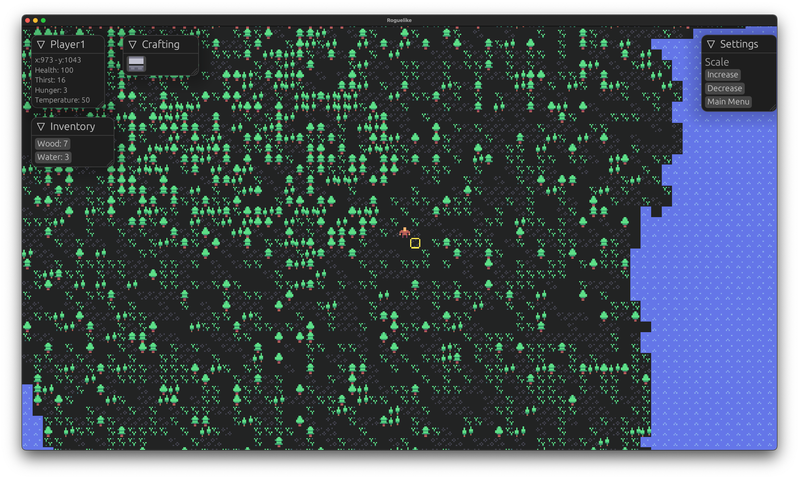

# Islander

The beginnings of a rougelike written in the Rust programming language, using the bevy game engine.

Mechanics implemented...

* WASD movement
* F to interact (collect water, gather wood from trees)
* Cursor position based on relative position of mouse to player
* Thirst and hunger attributes that increase over time
* Inventory items consumed on click, with water decreasing thirst when consumed
* Settings to increase/decrease UI scale and to go back to the main menu

